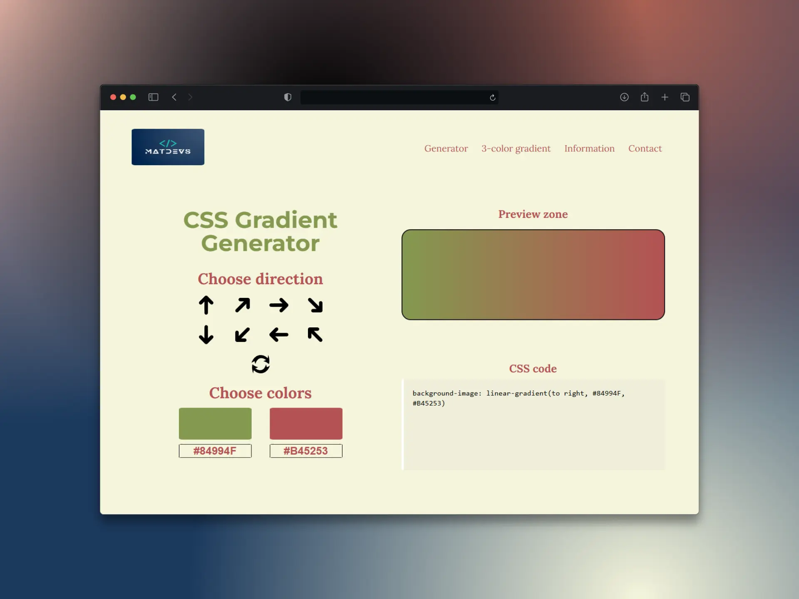

# 🎨 CSS Gradient Generator | MatDevs

Aplicación web interactiva que permite crear **gradientes CSS personalizados** de dos o tres colores, visualizar el resultado en tiempo real y copiar el código generado fácilmente.
Desarrollado con **HTML, SCSS y JavaScript** puro, utilizando **Vite** como herramienta de desarrollo para la organización y compilación del proyecto.

---

## 📸 Captura del proyecto



---

## 🌐 Ver demo

👉 [Haz clic aquí para ver la landing page](https://matusbh.github.io/Gradient-Creator/)

---

## 🚀 Características

- Generador de gradientes **de 2 y 3 colores**.  
- Selección de dirección del degradado (horizontal, vertical, diagonal, etc.).  
- Visualización en tiempo real de la **zona de previsualización**.  
- Copia directa del código CSS generado.  
- Diseño **limpio, responsivo y moderno**, creado con SCSS modular.  
- Versión totalmente **estática** y optimizada para GitHub Pages.

---

## 🧱 Tecnologías utilizadas

- **HTML5** → estructura y semántica.  
- **SCSS (Sass)** → estilos modulares y variables reutilizables.  
- **JavaScript (ES Modules)** → lógica de generación y actualización dinámica del gradiente.
- **Vite** → para servir y compilar el proyecto.  
-  **SASS** → preprocesador CSS utilizado para modularizar los estilos.

---

## 📁 Estructura del proyecto
```bash
/
/ (raíz)
├── 3-colors.html
├── Contacto.html
├── index.html
├── Info.html
│
├── css/
│   └── style.css
│
├── img/
│   
├── sass/                      
│   └── style.scss
│
├── src/
│   ├── main.js
│   └── components/
│       └── GradientGenerator.js
│
├── .gitignore
├── package.json
├── package-lock.json
└── README.md
```

---

## ⚙️ Cómo ejecutarlo

1. **Clona el repositorio:**
```bash
   git clone https://github.com/Matusbh/Gradient-Creator.git
   cd Gradient-Creator
 ```

Abre el proyecto en VS Code y ejecuta con Live Server:

 ```bash
   index.html
```

o en terminal:
```bash
   npx serve
```

Compila SCSS a CSS desde terminal:
```bash
   npm run sass
```

Abre en el navegador http://localhost:5500.

---

## 🧠 Aprendizajes y objetivos

**Este proyecto fue creado como práctica para reforzar:**
- El uso de **SCSS modular** y buenas prácticas de organización de estilos.
- El manejo de **JavaScrip**t modular con import/export.
- El trabajo con eventos **DOM** y manipulación de estilos en tiempo real.
- La estructuración de un proyecto listo para publicación en **GitHub Pages**.

---

## 🧑‍💻 Autor

- Matus Behun
- 📍 Tenerife, España
Desarrollador Frontend | **@MatDevs**


